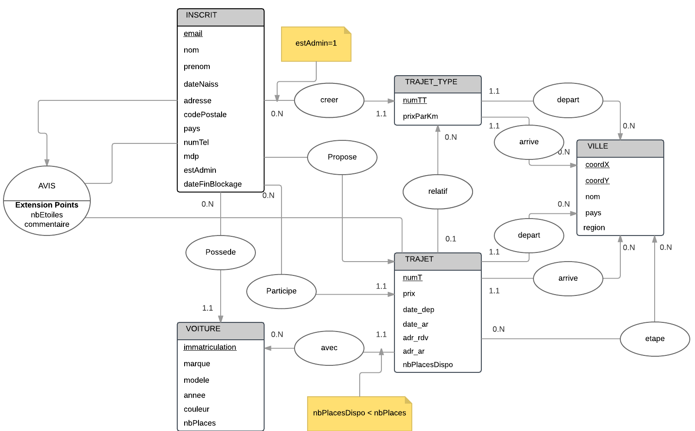

<br>
<br>
<br>
<br>
<br>
<br>
<br>
<br>
<br>
<br>
<br>
<br>
<br>
<br>
<br>
<br>
<br>
<br>
<br>
<br>
<br>
<br>
<br>
<br>
<br>
<br>

<CENTER>
<h1>RAPPORT DU PROJET BDD L3 2017</H1>
<h2>Wissem Soussi et Jérémie Daughtauribe</h2>
<h2>Decembre 2017</h2>
</CENTER>

<br>
<br>
<br>
<br>
<br>
<br>
<br>
<br>
<br>
<br>
<br>
<br>
<br>
<br>
<br>
<br>
<br>
<br>
<br>
<br>
<br>
<br>
<br>
<br>
<br>
<br>


<h4>1) MODÈLE ENTITÉ ASSOCIATION</h4>
<br>
<br>

<br>
<br>

<h4>2) MODÈLE RELATIONNEL</h4>
<br>
<br>
**INSCRIT**
(<u>email</u> , nom , prenom , dateNaiss , adresse , codePostale , pays , numTel , mdp , estAdmin , dateFinBlockage )

**VOITURE** (<u>immatriculation</u> , marque , modele , annee , couleur , nbPlaces , _emailProprietaire_ )

**VILLE**
(<u>coordX</u> , <u>coordY</u> , nomV , pays , region )

**TRAJET_TYPE**
( <u>numTT</u> , prixParKm , _villeDepX_ ,  _villeDepY_ , _villeArrX_ , _villeArrY_ , _emailAdmin_ )

**TRAJET**
( <u>numT</u> , prix , date_dep , date_ar , adr_rdv , adr_ar , nbPlacesDispo , _conducteur_ , _vehiculeImm_ ,  _villeDepX_ ,  _villeDepY_ , _villeArrX_ , _villeArrY_ , _numTrajetType_ )

**ETAPES**
( <u>_numT_</u> , <u>_coordX_</u> , <u>_coordY_</u> , nbPerRec , nbPerDes )

**PARTECIPER**
( <u>_numT_</u> , <u>_emailCovoitureur_</u> )

**AVIS**
( <u>_numT_</u> , <u>_numDonneur_</u> , <u>_numRéceveur_</u>, nbEtoile, commentaire )
<br>
<br>

ECLAIREMENT DE LA CONCEPTION
<br>
<br>
Un internaute qui rentre dans le site sans s'identifier peut (fichier “invite.sql”) rechercher des trajets en insérant la ville de départ, la ville d'arrivée, une date et une “tolérance” de jours: si par exemple la date est le 10/01/2018 et la tolérance est de 5 jours les trajets affichés seront ceux du 05/01/2018 jusqu’à 15/01/2018.
Si la borne inférieure de cet interval est inférieur à la date courante alors la borne inférieure va être changée par la date courante.
Les trajets vont être affichés par ordre croissant des dates de départ et ceux qui n’ont plus de places disponibles ne seront pas pris en compte.

Pour chaque trajet on affichera d’une façon supplémentaire les dates de départ et d'arrivée, la distance en kilomètres, le prix et le nom du conducteur (sans autres informations sur ce dernier).
Pour avoir plus d’information sur le conducteur d’un trajet et pour participer à ce dernier il faudra s’ inscrir (fichier “invite.sql”) et devenir membre du site.
Le membre sera identifié par un email, et il devra émettre obligatoirement son nom, prénom, date de naissance, numéro de téléphone et un mot de pass (fichier “createTablesMYSQL.sql” -> `table inscrit`).
Le ranking des membres est entre 0 et 5 (l'évaluation classique par nombre d'étoiles) et il n’y a pas de limite d’age, par contre la date de naissance ne doit pas bien-sûr être supérieur à la date courante et l’age maximale est de 120 ans (fichier “createTablesMYSQL.sql” -> `trigger VERIF_INSCRIT`).

**PS**: chaque trigger dans la base de données est dupliqué en trigger `before insert` et trigger `before update` puisque MYSQL ne permet pas de faire ` insert OR update` .

Un membre peut enregistrer dans la base de données une voiture qu’il utilise pour le covoiturage; la voiture sera identifiée par l’immatriculation, et devra obligatoirement avoir une marque, un modèle, un nombre de places et l’email du propriétaire qui doit être un membre du site (fichier “createTablesMYSQL.sql” -> `table voiture`).
La date d’immatriculation, si spécifiée, doit être inférieur à la date d’aujourd’hui et supérieur au 1883 (premières voitures commercialisées) et le nombre de places se situe entre 0 et 9 (si superieur de 9 on parle de mini-bus et ne plus de voitures) (fichier “createTablesMYSQL.sql” -> `trigger VERIF_VOITURE`).


<h4>EXEMPLE DE CODE SQL DANS MARKDOWN ;)</h4>
<br>
<br>
```sql
insert into voiture (immatriculation, marque, modele, annee, couleur, nbPlaces, emailProprietaire)
values ("value", "value", "value", "value", "value", "value", "value");
```
